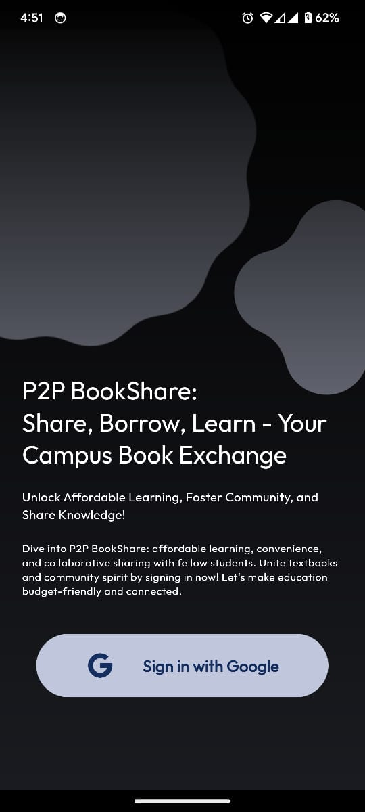
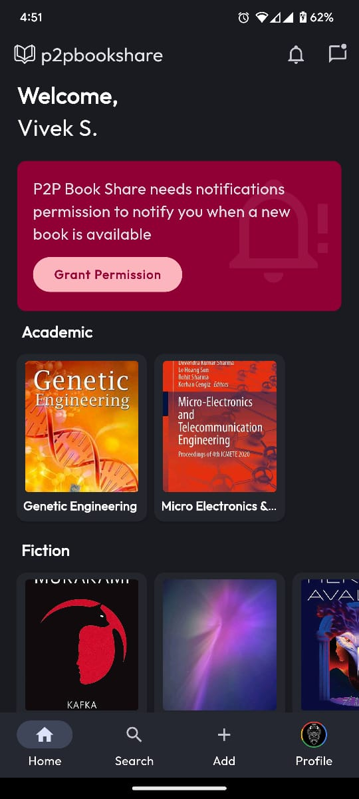
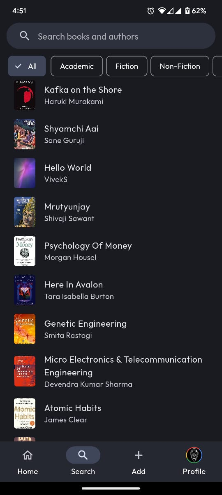
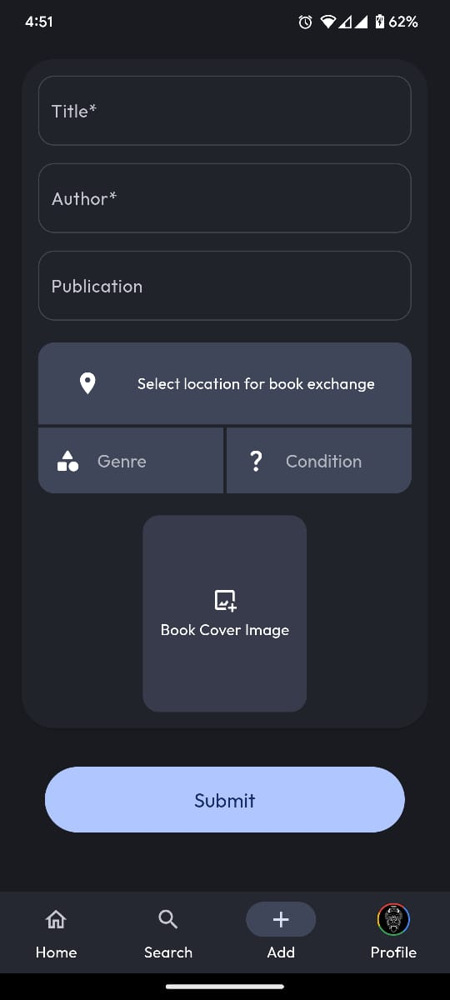
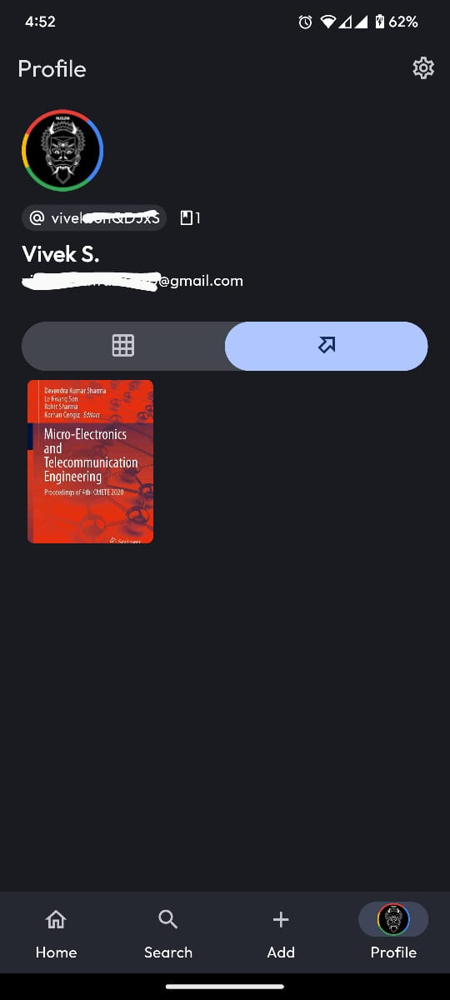
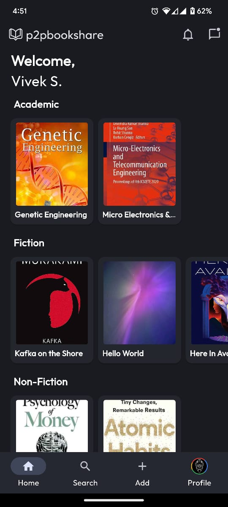
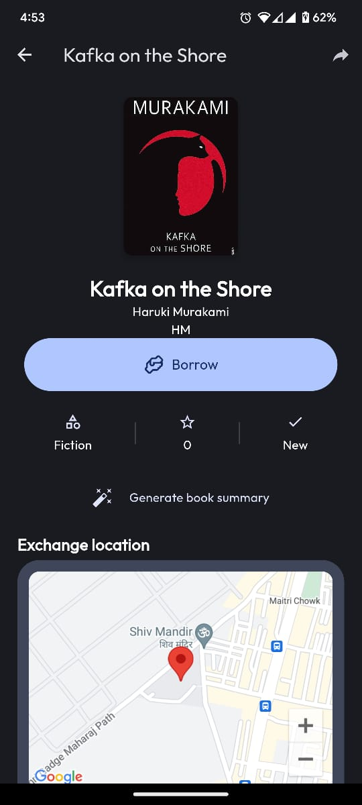
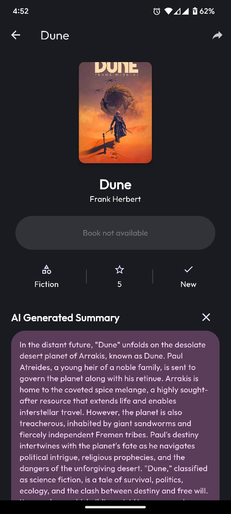
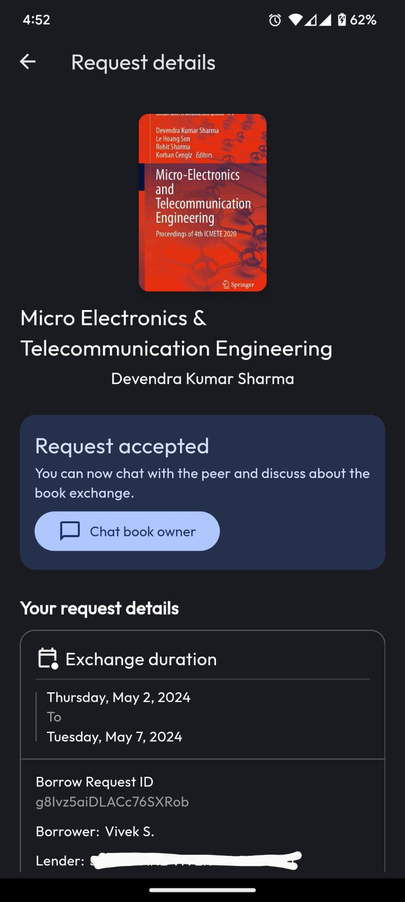
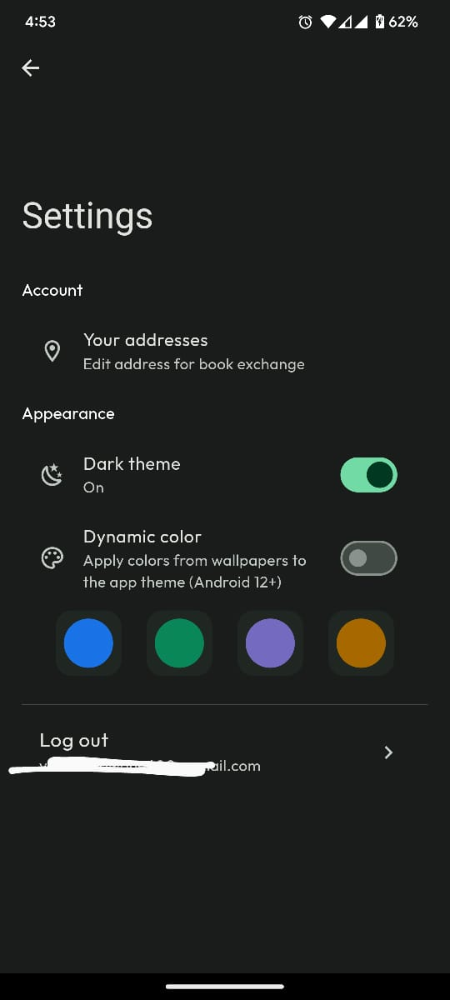

<p align="center">
  <a href="https://github.com/viveeeeeek/p2pbookshare">
    
    <h1 align="center">P2P Book Share</h1>
  </a>
</p>


A user-friendly Flutter app designed for college students to easily share, borrow, and lend books on campus.

## Screenshots

|  |  |  | | |
|:---:|:---:|:---:|:---:|:---:|
| Login | Home | Search | Upload Book | Profile |

|  |  |  | | |
|:---:|:---:|:---:|:---:|:---:|
| Home | Request Book | AI Summary | Request Details | Settings |

## Steps to build 
1. Clone the project:
    - Use `git clone https://github.com/viveeeeeek/p2pbookshare.git` to download the project from the GitHub repository. 

2. Install Dependencies:
   * Navigate to the project directory and run `flutter pub get` to install the required dependencies.

3. Set Up Environment Variables (.env File):
     ```
      GOOGLE_MAPS_API_KEY=YOUR_GOOGLE_MAPS_API_KEY
      GEMINI_PRO_API_KEY=YOUR_GEMINI_PRO_API_KEY
      FIREBASAE_PROJECT_ID=YOUR_FIREBASE_PROJECT_ID
      ```

    - **Google Maps API Key:** Create a project in the [Google Cloud Console](https://console.cloud.google.com/) and enable the Google Maps Platform APIs and obtain the API key.
    - **Gemini Pro API Key:** Obtain currently Gemini Pro API key, which is free of cost as of now [here](https://aistudio.google.com/app/apikey).
    - **Firebase Project Information:** Create a Firebase project in the [Firebase Console](https://console.firebase.google.com/) and note down the Project ID and API Key for Cloud Messaging.

4. Configure Firebase for both iOS and Android platforms:
    - Ensure the `build.gradle` file is properly set up and includes all necessary Firebase dependencies. Add the `google-services.json` file for Android and the `GoogleService-Info.plist` file for iOS to your project. Additionally, create and include the `firebase_options.dart` file in the lib/ directory to manage Firebase configuration options.

5. Configure both debug and release builds in the app/`build.gradle` file. Create and properly set up the `key.properties` file to securely manage your signing keys and other sensitive information.

6. Create a service account within the Google Cloud Console and obtain the `service_account.json` file, which is used for sending push notifications on Android. Place this file in the assets/fcm/ folder of your project.
    - Create a Service Account in Google Cloud Console
    - Navigate to the [Google Cloud Console](https://console.cloud.google.com/).
    - Go to the "IAM & Admin" section and select "Service Accounts".
    - Click "Create Service Account".
    - Provide a name and description for the service account.
    - Grant the service account the "Firebase Admin SDK Administrator Service Agent" role.
    - After creating the service account, go to the "Keys" section of your new service account.
    - Click "Add Key" and select "Create New Key".
    - Choose "JSON" format and click "Create".
    - Download the `service_account.json` file.
    - Place the downloaded `service_account.json` file in the `assets/fcm/` folder of your Flutter project.

